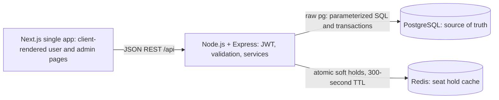

# Technical Requirements Document: Ticket Booking Platform V1

Based on [PRD.md](PRD.md). This document defines a small take-home implementation, not a production ticketing system.

## 1. Architecture and choices



- Use TypeScript for both applications. Choose **Express** because a small REST API needs little framework scaffolding; route middleware, service functions, and SQL repositories are sufficient for this timeframe.
- Use **raw node-postgres (`pg`)**, with a checked-out client and `client.query` for every statement from `BEGIN` to `COMMIT`/`ROLLBACK`. Do not use `pool.query` inside a transaction. This makes explicit SQL row locking straightforward. See [node-postgres transactions](https://node-postgres.com/features/transactions).
- Next.js is one frontend application. Pages fetch data in the browser; no catalog SSR, server actions, or parallel Next.js business API. Reverse-proxy `/api` to Express for a single browser origin.
- Client routes: `/`, `/events/[id]`, `/shows/[id]/seats`, `/checkout`, `/bookings`, `/bookings/[id]`, `/login`; admin routes: `/admin`, `/admin/venues`, `/admin/screens`, `/admin/events`, `/admin/shows`, `/admin/bookings` and their edit/detail views.
- A client auth provider gates private pages and checks `role === 'admin'` for `/admin/*`. Express independently enforces authentication and authorization; hiding pages is not a security boundary.
- PostgreSQL owns events, inventory definitions, confirmed sales, and idempotency records. Redis holds are temporary reservations, never proof that a ticket was sold.
- Payment is an in-process success/failure stub. No payment service, queue, notification worker, or additional database entities.

## 2. Database schema

Use **exactly these eight entities**. The requested fields are retained; primary keys and minimal supporting fields are specified below. IDs are UUIDs generated by the backend. Fields are NOT NULL unless marked nullable. Timestamps are `timestamptz`, stored in UTC. Amounts are `numeric(12,2)` in INR and serialized as decimal strings.

| Entity | Columns |
|---|---|
| venues | `venue_id uuid PK`, `name text`, `address text` |
| screens | `screen_id uuid PK`, `venue_id uuid FK -> venues`, `name text`, `layout_json jsonb DEFAULT '{}'` |
| seats | `seat_id uuid PK`, `screen_id uuid FK -> screens`, `row text`, `number integer`, `seat_type text DEFAULT 'standard'`, `price_tier text DEFAULT 'base'` |
| events | `event_id uuid PK`, `type text CHECK IN ('movie','standup','concert')`, `title text`, `duration integer` (minutes), `poster_url text nullable`, `description text DEFAULT ''` |
| shows | `show_id uuid PK`, `event_id uuid FK -> events`, `screen_id uuid FK -> screens`, `start_time timestamptz`, `end_time timestamptz`, `base_price numeric(12,2)` |
| bookings | `booking_id uuid PK`, `user_id uuid FK -> users`, `show_id uuid FK -> shows`, `status text CHECK IN ('confirmed')`, `total_amount numeric(12,2)`, `created_at timestamptz DEFAULT now()`, `idempotency_key uuid`, `request_hash text`, `hold_token uuid` |
| booking_seats | `booking_id uuid`, `seat_id uuid FK -> seats`, `show_id uuid FK -> shows`, `price numeric(12,2)`, `PRIMARY KEY (booking_id, seat_id)` |
| users | `user_id uuid PK`, `name text`, `email text`, `password_hash text`, `role text CHECK IN ('user','admin')` |

Supporting fields serve existing requirements: event description, booking history time, and durable confirmation deduplication. `booking_id` is also the public booking reference. Failed payment attempts create no booking; cancellation and pending-payment lifecycles are excluded.

### Constraints and indexes

- Unique `lower(users.email)`; normalize email before lookup and insertion.
- Unique `(screen_id, row, number)` on seats; positive seat number and event duration; nonnegative prices and totals; `end_time > start_time`.
- Unique `(show_id, seat_id)` on booking_seats: the database backstop against double booking.
- Unique `(booking_id, show_id)` on bookings, with composite foreign key `booking_seats(booking_id, show_id) -> bookings(booking_id, show_id)`. A booking cannot contain seats for a different show ID.
- A database trigger on booking_seats verifies that the seat's `screen_id` equals the show's `screen_id`. Service validation also checks this before inserting.
- Unique `(user_id, idempotency_key)` and unique `hold_token` on bookings. A checkout hold token can produce only one confirmed booking, even if a client sends a different idempotency key.
- Index shows `(event_id, start_time)` and `(screen_id, start_time)`; bookings `(user_id, created_at DESC)` and `(show_id)`; screens `(venue_id)`. Seat uniqueness and booking-seat uniqueness cover inventory lookups.
- All foreign keys use restricted deletion. Delete an unreferenced screen's seats explicitly in the same transaction before deleting the screen.
- Prevent schedule overlap in the service while locking the screen row with `FOR UPDATE`: conflict when `existing.start_time < new.end_time AND existing.end_time > new.start_time`. All show creation/rescheduling follows this protocol; adjacent shows are allowed. Store the derived end time when scheduling; later event-duration edits do not alter existing shows.

### Seat layout representation

```json
{
  "rows": 3,
  "seats_per_row": 5,
  "orientation": "stage_top",
  "disabled_positions": [{"row":"B","number":3}]
}
```

`layout_json` defines geometry and disabled gaps. Generate seats only for enabled positions; capacity is the count of seat rows. Seat labels are `row + number`, e.g. A1. Use `seat_type='standard'` and `price_tier='base'`; these required columns do not introduce tier pricing. Every sold seat uses its show's base price, copied into booking_seats.price.

Saving a layout locks its screen, verifies that no show references it, and replaces layout JSON and generated seats atomically. Show creation locks the same screen before checking the layout, preventing a concurrent layout replacement. Preview is computed locally using the same deterministic row-label convention (A–Z, AA–AZ, etc.).

## 3. Seat concurrency and booking confirmation

### Why a naive availability check races

Request A and request B can both read “no booking exists” for the same show-seat before either writes. Both then attempt to sell it. An availability response is a snapshot, not a reservation. Even `SELECT ... FOR UPDATE` against an empty booking_seats result locks no inventory row, so it cannot protect a seat that has never been booked.

### Redis soft holds

Implement SETNX semantics with **`SET seat:{show_id}:{seat_id} value NX EX 300`**, atomically setting both ownership and expiry. Do not issue separate SETNX and EXPIRE commands, which leave an unexpiring key if the process dies between them. See [Redis SET](https://redis.io/docs/latest/commands/set/).

- Value: serialized `{user_id, hold_token}`. Generate an unpredictable token per checkout selection. Never return another user's token or identity in availability responses.
- Redis also stores `hold:{hold_token}` containing owner, show, sorted seat IDs, and deadline, with the same five-minute TTL. This is cache metadata, not another database entity.
- The mandatory single-seat endpoint acquires a hold immediately when invoked. The main UI follows the PRD: clicks are local selection, and Continue submits all selected seats to the batch endpoint. Both endpoints use the same acquisition service; the single-seat endpoint is a one-seat batch. Do not call it sequentially for a multi-seat checkout.
- A Lua script checks every requested seat key and then creates all seat keys and hold metadata in one atomic execution. If any key is occupied, create nothing. Limit a checkout to 1–6 distinct seats. One Redis instance is sufficient; Redis Cluster is excluded.
- Repeating a successful hold request with the same token, owner, and exact seat set returns its remaining TTL without extending it. Token reuse with different content returns 409. Clients generate a new token for a fresh selection.
- Explicit release uses an atomic compare-and-delete script, deleting only keys whose token and owner match. Missing or expired keys are a successful no-op. Releasing an old token cannot remove a new user's hold.
- No refresh or extension: TTL expiry releases the reservation automatically. No scheduler or keyspace notification is necessary.

### PostgreSQL guard and cross-store coordination

For a deliberately simple V1, **all hold acquisitions, explicit releases, confirmations, and admin show mutations lock the existing show row** within a short PostgreSQL transaction before validating or mutating inventory:

```sql
SELECT show_id, screen_id, start_time, base_price
FROM shows WHERE show_id = $1 FOR UPDATE;
```

This provides a stable row to lock even when no booking exists. Ordinary seat-map reads never request row locks. No transaction stays open while the user chooses seats or simulates payment. It serializes short mutations per show, a documented throughput tradeoff appropriate to the take-home; finer-grained inventory locking is excluded. PostgreSQL row locks are held until transaction end; see [PostgreSQL explicit locking](https://www.postgresql.org/docs/current/explicit-locking.html).

Acquisition holds this guard while checking show start time, seat membership, and existing booking_seats, then running the Redis acquisition script. Release follows the same guard. Therefore a new acquisition cannot slip between final hold validation and a booking commit. Admin show edits/deletes take the guard and reject active Redis holds or confirmed bookings. Check known seat keys using batched reads, not Redis KEYS. Scheduling operations that need both locks acquire screen first, then show; other inventory paths only acquire show.

### Confirmation algorithm

`POST /bookings/confirm` requires `Idempotency-Key` and `{show_id, seat_ids, hold_token, payment_result}`.

1. Authenticate, validate UUIDs and 1–6 distinct seat IDs, and hash the canonical request (show, sorted seat IDs, token, payment outcome). Look for an existing booking by authenticated user and idempotency key **before checking Redis**. Matching replay returns the persisted ticket; a changed payload returns 409.
2. Check out a `pg` client, `BEGIN` at READ COMMITTED, lock the show row with the SQL above, and repeat the idempotency lookup after waiting for the lock. Also look up the hold token: the same owner and selection returns the original booking; incompatible reuse returns 409.
3. Recheck that the show has not started, all requested seats belong to its screen, and none exist in booking_seats for this show. Reject unavailable seats with 409.
4. Atomically verify the Redis hold metadata and every seat key: owner, token, exact set, and positive remaining TTL. Missing, expired, or mismatched holds reject with 409. Redis unavailability aborts with 503.
5. Treat this final successful validation as the reservation acceptance instant. If the TTL expires immediately afterward, the in-flight transaction may finish: all reacquisitions must wait for the show guard and then see the committed booking. Holds already expired at validation are rejected. Likewise, show start is checked at this acceptance point; do no slow work afterward.
6. For stub failure, roll back and return 402 `PAYMENT_FAILED`; preserve the original hold deadline and create no booking. A retry that changes failure to success uses a fresh idempotency key. The stub does no network I/O.
7. For success, calculate total using database price, insert the confirmed booking and its booking_seats with parameterized `client.query`, then `COMMIT`. Never trust a client-supplied price, total, user ID, or status.
8. After commit, compare-and-delete Redis keys for this token; return 201. Cleanup failure is logged but does not undo a sale. Persisted booked status overrides any leftover hold in subsequent reads.
9. On any pre-commit error, `ROLLBACK`; always release the client in `finally`. A uniqueness conflict rolls back, then performs a fresh lookup: return the matching existing booking for a replay or 409 for an actual seat/payload conflict. If commit outcome is uncertain, the client retries with the same key.

This is not a distributed transaction. Redis loss can remove a visible reservation, requiring reselection, but cannot create duplicate confirmed seats. A crash after acquisition may leave a hold until TTL expiry. A crash after PostgreSQL commit is recovered through the durable idempotency lookup, even if Redis cleanup never ran. In-flight expiry is safe because acquisition shares the PostgreSQL guard.

Compared with pure pessimistic locking, this avoids holding database locks throughout browsing or the five-minute checkout window, and does not lock the whole show on every seat view. Compared with pure optimistic locking, it gives users a visible temporary reservation instead of discovering all conflicts only at checkout. The database uniqueness constraint still remains the final integrity backstop.

## 4. API contract

All paths below are relative to `/api`. JSON requests/responses; UUID IDs; ISO-8601 UTC timestamps; decimal-string monetary amounts. GET requests and DELETE endpoints have no body unless specified. Successful reads/updates return 200, creates return 201, deletes return 204. Authenticated calls send `Authorization: Bearer <JWT>`.

Errors use `{ "error": { "code": "SEAT_UNAVAILABLE", "message": "...", "details": {} } }`. Common statuses: 400 invalid input, 401 missing/invalid/expired JWT, 403 wrong role, 404 resource not found, 409 conflict, 402 stub payment failure, 503 dependency unavailable. Cross-user booking lookups return 404.

List responses are `{items: T[], total: number, page: number, page_size: number}`. All list endpoints accept `page` (default 1) and `page_size` (default 20, maximum 100). Extra supported filters are listed below. Objects shown as types below are the full reusable response shapes, not additional entities.

### Shared response shapes

```ts
type User = { user_id: string; name: string; email: string; role: 'user'|'admin' };
type Venue = { venue_id: string; name: string; address: string };
type Layout = { rows: number; seats_per_row: number; orientation: 'stage_top';
  disabled_positions: {row: string; number: number}[] };
type Screen = { screen_id: string; venue_id: string; name: string;
  layout_json: Layout | {}; capacity: number };
type Event = { event_id: string; type: 'movie'|'standup'|'concert'; title: string;
  duration: number; description: string; poster_url: string|null };
type Show = { show_id: string; event_id: string; screen_id: string;
  start_time: string; end_time: string; base_price: string;
  event_title: string; venue: Venue; screen_name: string };
type Hold = { hold_token: string; show_id: string; seat_ids: string[];
  expires_at: string; server_time: string };
type Ticket = { booking_id: string; user_id: string; show_id: string;
  status: 'confirmed'; total_amount: string; currency: 'INR'; created_at: string;
  event: {event_id: string; title: string}; venue: Venue;
  screen: {screen_id: string; name: string}; start_time: string; end_time: string;
  seats: {seat_id: string; row: string; number: number; label: string; price: string}[] };
```

### Authentication and user APIs

| Method and path | Access | Request / query | Response |
|---|---|---|---|
| POST /auth/login | Public | `{email, password}` | `{access_token, expires_in: 3600, user: User}` |
| GET /auth/me | Signed in | None | `User` |
| GET /events | Public | Optional `type=movie|standup|concert` | Paginated `Event`; only events with upcoming shows |
| GET /events/{id} | Public | None | `Event` |
| GET /events/{id}/shows | Public | None | Paginated upcoming `Show`, ascending start time |
| GET /shows/{id} | Public | None | `Show` |
| GET /shows/{id}/seats | Public; optional JWT | None | Seat-map shape below; signed-in users see `held_by_me` |
| POST /shows/{id}/seats/{seat_id}/hold | Signed in | `{hold_token: UUID}` | `Hold` for one seat; 200 on matching retry |
| POST /shows/{id}/holds | Signed in | `{hold_token: UUID, seat_ids: UUID[]}` | `Hold` for atomic 1–6 seat selection; 200 on matching retry |
| GET /shows/{id}/holds/{hold_token} | Owner | None | `Hold`; 409 `HOLD_EXPIRED` when absent; 404 when owned by another user |
| DELETE /shows/{id}/holds/{hold_token} | Owner | None | 204; releases entire selection; absent token is no-op |
| POST /bookings/confirm | Signed in | Header `Idempotency-Key: UUID`; `{show_id, seat_ids, hold_token, payment_result: 'success'|'failure'}` | `Ticket`, 201 first success / 200 replay |
| GET /bookings | Signed in | None | Paginated `Ticket` for current user, newest first |
| GET /bookings/{id} | Owner | None | `Ticket` |

Logout clears the frontend's in-memory token; there is no refresh-token or logout API in V1. A page reload requires sign-in again. Hold lookup restores the checkout deadline after reauthentication when the token remains in session storage. Never store passwords or JWTs there.

Seat-map response:

```json
{
  "show_id": "uuid",
  "layout_json": {"rows":3,"seats_per_row":5,"orientation":"stage_top","disabled_positions":[]},
  "base_price": "250.00",
  "server_time": "2026-09-08T10:00:00Z",
  "seats": [
    {"seat_id":"uuid","row":"A","number":1,"label":"A1","seat_type":"standard","price_tier":"base","status":"available","expires_at":null}
  ]
}
```

Status is `available | held_by_me | held_by_other | booked`. `expires_at` is non-null for held seats. Local `selected` is UI state, not an API status. Query persisted bookings and batched Redis values/TTLs; booked always wins. Responses are snapshots and never guarantee subsequent acquisition.

### Admin APIs

Every endpoint below requires a verified JWT with `role='admin'`. PATCH bodies accept a nonempty subset of the corresponding create fields, except immutable parent references noted below.

| Method and path | Request / query | Response |
|---|---|---|
| GET /admin/venues | Pagination | Paginated `Venue` |
| POST /admin/venues | `{name, address}` | `Venue` |
| GET /admin/venues/{id} | None | `Venue` |
| PATCH /admin/venues/{id} | `{name?, address?}` | `Venue` |
| DELETE /admin/venues/{id} | None | 204; 409 if screens exist |
| GET /admin/screens | Pagination; optional `venue_id` | Paginated `Screen` |
| POST /admin/screens | `{venue_id, name}` | `Screen` with empty layout |
| GET /admin/screens/{id} | None | `Screen` |
| PATCH /admin/screens/{id} | `{name}`; venue is immutable | `Screen` |
| DELETE /admin/screens/{id} | None | 204; 409 if shows exist |
| PUT /admin/screens/{id}/layout | `Layout` | `Screen`; 409 if any show references it |
| GET /admin/events | Pagination; optional `type` | Paginated `Event`, including unscheduled events |
| POST /admin/events | `{type, title, duration, description, poster_url?}` | `Event` |
| GET /admin/events/{id} | None | `Event` |
| PATCH /admin/events/{id} | Partial event create body | `Event` |
| DELETE /admin/events/{id} | None | 204; 409 if shows exist |
| GET /admin/shows | Pagination; optional `event_id`, `screen_id` | Paginated `Show`, including past shows |
| POST /admin/shows | `{event_id, screen_id, start_time, base_price}` | `Show`; end_time derived server-side |
| GET /admin/shows/{id} | None | `Show` |
| PATCH /admin/shows/{id} | `{event_id?, start_time?, base_price?}`; screen immutable | `Show`; recalculate end_time if event/start changes |
| DELETE /admin/shows/{id} | None | 204; 409 if holds/bookings exist |
| GET /admin/bookings | Pagination; optional `show_id` | Paginated `Ticket`, newest first |
| GET /admin/bookings/{id} | None | `Ticket` |
| GET /admin/analytics | None | Analytics shape below |

Show creation/edit requires a future start, configured nonempty layout, and no overlap. Show edit/delete rejects active holds or confirmed bookings. Venue/screen/event deletion follows foreign-key restrictions. Layout writes reject invalid disabled positions, duplicate positions, or zero capacity. Limit layouts to 26 rows and 30 positions per row for this demo; price values allow at most two fractional digits.

Analytics response:

```ts
{
  currency: 'INR',
  total_revenue: string,
  confirmed_booking_count: number,
  seats_sold: number,
  shows: {show_id: string; event_title: string; start_time: string;
    seats_sold: number; capacity: number; occupancy_percent: number; revenue: string}[]
}
```

Compute all-time totals directly from confirmed bookings. Compute per-show seats/revenue from booking_seats and capacity from seats. Aggregate separately before joining to avoid multiplying booking totals by seat counts. Include unsold shows with zero values. No analytics cache, chart service, or date filtering.

## 5. Non-functional requirements

- **Correctness:** no duplicate confirmed `(show_id, seat_id)`; booking and all its seats commit together; no partial multi-seat hold. Durable idempotency fields live on bookings for the lifetime of the booking, so retries after token expiry or response loss still resolve to the same ticket.
- **Expiry:** five minutes from acquisition, no automatic renewal. Server TTL is authoritative; client countdown uses `server_time` and `expires_at`. Expired checkout disables confirm and returns to selection. The final validation instant described above determines acceptance.
- **Freshness:** poll the seat map every one second while it is visible to leave latency budget for the PRD's two-second target under local demo conditions. Refresh immediately on focus, hold/release, and conflicts; stop polling on navigation. Handle background browser throttling by refetching on focus. No WebSockets required.
- **Authorization:** JWT middleware verifies signature using an explicitly allowed algorithm, expiry, issuer, and audience, then uses `sub` as user ID. Admin middleware verifies the signed role claim. Tokens expire in one hour; seeded roles are not editable in V1. Booking queries include `user_id = authenticated sub`.
- **Security:** hash seeded passwords with bcrypt, use parameterized SQL, validate request bodies and limits, keep secrets in environment variables, never expose password hashes or log JWTs/hold tokens. Use HTTPS when deployed. In-memory bearer JWTs avoid cookie-based CSRF handling for this version.
- **Dependency failures:** if Redis is unavailable, return 503 for seat availability, hold, release, and new confirmation rather than inventing availability. Catalog and persisted tickets remain readable; completed confirmation replays can be served from PostgreSQL. Redis restart may lose unconfirmed holds. PostgreSQL failure prevents new bookings.
- **Bounded transactions:** configure short SQL lock/statement timeouts and Redis request timeouts; target completion within two seconds in normal local operation. Roll back on timeout and return a retryable 503. Never await user input or an external payment provider while holding a database lock.
- **Usability:** seat buttons support keyboard interaction, readable labels, and text/legend indicators beyond color. Display loading, empty, expired-hold, unavailable-seat, payment-failure, and API-error states.
- **Observability:** log request ID, endpoint, response status, duration, and database conflict/dependency errors without secrets. No monitoring platform required.

## 6. Implementation and verification boundary

Use a small repository structure: `frontend/` for Next.js; `backend/` for Express routes, middleware, services, and pg repositories; `backend/db/` for SQL migrations and seed data. A local Compose file runs PostgreSQL and Redis. Seed an admin, two users, and a few events/shows with a small layout. Provide environment-variable examples and start/migrate/seed commands in the eventual README.

Required checks when implementing:

1. Two users race for the same seat: one hold succeeds; a conflicting batch creates no partial holds.
2. Expiry, explicit release, and stale-token release behave correctly; another client reflects changes within two seconds under demo conditions.
3. Concurrent confirmation requests, including identical keys and different keys for one token, produce exactly one booking.
4. Expiry during confirmation and reacquisition cannot sell the same seat twice; a hold expired before validation cannot confirm.
5. A crash/response loss after commit followed by retry returns the existing ticket; Redis cleanup failure does not hide booked seats.
6. Stub failure leaves no booking and permits a success retry before expiry. Wrong-user holds and booking access are rejected; user JWTs cannot call admin APIs.
7. Concurrent schedule/layout operations preserve overlap and layout restrictions. Active holds/bookings block show changes.
8. Analytics match known seeded totals; one browser smoke flow covers admin setup and user booking/ticket retrieval.

Keep all PRD exclusions: no real payments, notifications, multi-city search, coupons, recommendations, cancellations/refunds, QR tickets, account management, or advanced admin tooling.
